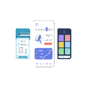

<!-- ========================================================= -->
<!-- 🚀 APP LANDING PAGE STYLE README                          -->
<!-- ========================================================= -->


<p align="center">
  
</p>


<!-- HERO SECTION WITH SVG GRADIENT TITLE -->
<p align="center">
  
</p>

<h3 align="center">UI/UX Designer · Flutter Developer · AI Product Builder</h3>

<p align="center">
  
</p>

<p align="center">
  Bringing app-quality visuals and smooth interactions to everything I build.
</p>

---

## 🚀 **What I Do (Landing Page Style Features)**

### 🎨 Beautiful UI/UX
- Modern visual systems  
- Micro-interactions  
- Motion-guided UX  
- Design Systems & Components  

---

### 📱 Flutter Development
- Production-ready apps  
- Firebase backend  
- Clean architecture  
- Custom animations  

---

### 🤖 AI-Powered Products
- OpenAI Integrations  
- OCR (Google ML Kit)  
- Smart automation flows  
- Scalable cloud functions  

---

## 🌈 Featured Apps (Showcase Sections)

### 🎧 **Modern Flutter Music Player**
- Background playback  
- Animated UI  
- Firebase streaming  
- Playlist & search system  

---

### 📦 **Smart Medicine Box**
- OCR → AI NER pipeline  
- Extract & classify medicine info  
- Auto-expiry alerts  
- Clean health assistant interface  

---

### 🛒 **Farmer–Customer Platform**
- UPI-based ordering  
- Real-time product flow  
- Role-based UI  
- Built fully in Flutter  

---

### 📚 **UI Helper App**
- UI/UX learning modules  
- Styled components  
- AI design assistant  
- Dynamic component rendering  

---

## 📊 **App Analytics Style GitHub Stats**

<p align="center">
  
  
</p>

<p align="center">
  
</p>

---

## 🌐 **Socials**
<p align="center">
  <a href="https://www.behance.net/eshwarsriram">🎨 Behance</a> •  
  <a href="https://dribbble.com/eshwar_chandra">🖌️ Dribbble</a> •  
  <a href="https://www.linkedin.com/in/eshwar-chandra-sriram">💼 LinkedIn</a>
</p>

---

## 🧭 **Design Philosophy**
> “If it feels smooth, simple, and intentional—then it’s a great product.”

<p align="center">
  
</p>

---

## 🧩 Reusable App-Style UI Blocks

### Feature Block  
```md
### ⭐ Feature Name
Short description of what it does and why it matters.
